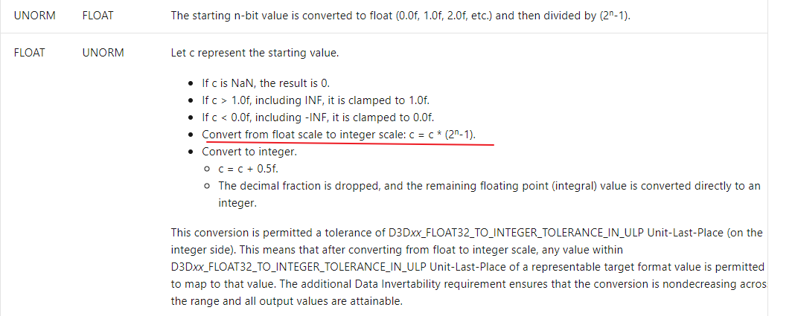

# UE-Civil-scientist-Research
UE民科知识大全

-   `ShaderCompileWorker`如何调试？

    [Debug ShaderCompileWorker](https://docs.unrealengine.com/en-US/Programming/Rendering/ShaderDevelopment/index.html)

    

-   `DXGI_FORMAT_R10G10B10A2_UNORM`的精度为什么比`DXGI_FORMAT_R11G11B10_FLOAT`高?

`DXGI_FORMAT_R10G10B10A2_UNorm`是用整数表示小数，其表示方法为:

`DXGI_FORMAT_R11G11B10_FLOAT`由于是浮点数，需要记录指数位以及尾数，因此精度是低于`DXGI_FORMAT_R10G10B10A2_UNORM`的

但`DXGI_FORMAT_R11G11B10_FLOAT`可以表示非0~1范围的值

而`DXGI_FORMAT_R10G10B10A2_UNorm`只能表示0~1范围的值

[d3d10 graphics programming guide resources data conversion](https://docs.microsoft.com/en-us/windows/win32/direct3d10/d3d10-graphics-programming-guide-resources-data-conversion)